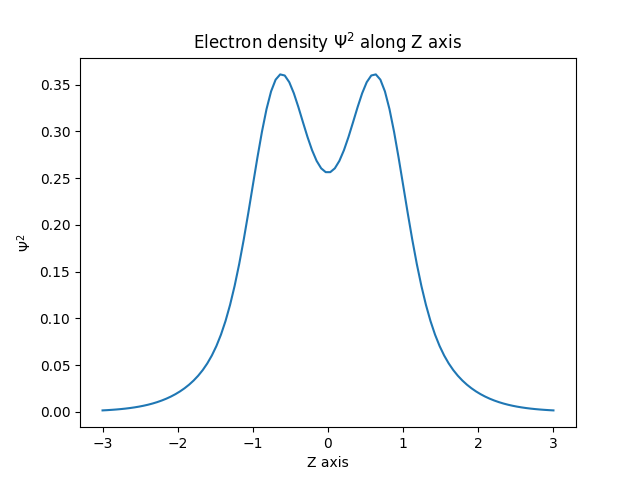

# Simple SCF with Python

The main.py code inside this folder executes an SCF procedure for the H2 molecule at the level of theory HF/STO-3G, following the instructions from widely known book "Modern Quantum Chemistry", by Szabo and Ostlund. The main porpouse of this code was to learn and practice the principles described in the book.

